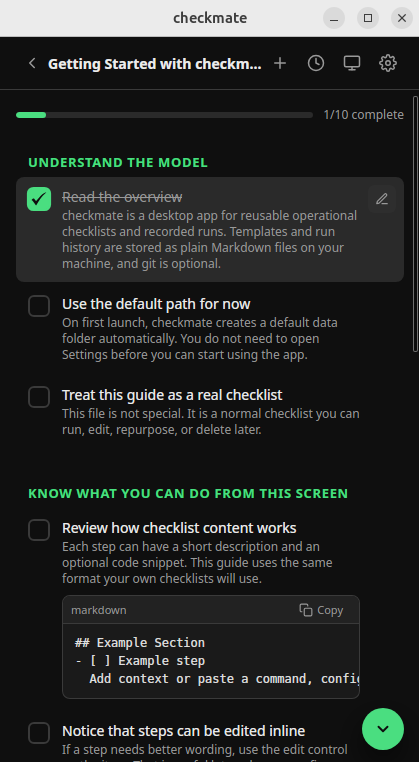
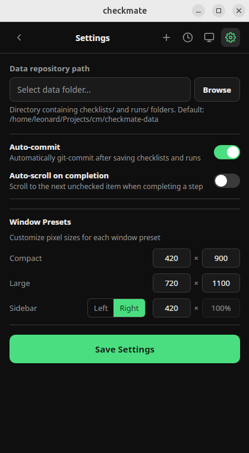

<h1>
   checkmate
</h1>

[](https://github.com/leonardgrube/checkmate/actions/workflows/ci.yml)
[](LICENSE)
[](https://github.com/leonardgrube/checkmate/releases)

checkmate is a cross-platform desktop app for reusable checklists and recorded runs. Templates and run history live as plain markdown files on your machine, with optional git backing if you want version history and sync.

**Why build another checklist app?**

> Less friction. Most checklist tools today are SaaS, bloated, UI-focused and often not built for repetition. I wanted something local and lightweight. Something to click, something to copy code and a window that stays pinned while I work. I hope you'll like it.
>
> ~ Leonard

## What makes checkmate awesome:

- **Stays in the foreground while you work in another window. (toggle on/off)**
- Checklist templates and saved runs are just markdown files.
- Inline editing of checklist items while executing a checklist without switching context.
- Hot reloading for checklist updates.
- Customizable compact, large, and sidebar window presets.
- Git is optional, but auto-commit is built in and can be activated if your data folder is a repo.
- Includes a prompt snippet to help an AI draft correctly structured checklists.
- It has a nice logo!

**Supported systems:** Linux, macOS, Windows

<p align="center">
  
  
  
</p>

## Quickstart

On first launch, checkmate creates a default data folder and seeds a starter checklist that explains the workflow inside the app.

If you want to use your own folder instead, for example `~/checkmate-data`:

```bash
mkdir ~/checkmate-data
```

Then open Settings in checkmate and point the data path to that folder. checkmate will store:

- `checklists/` for reusable checklist templates
- `runs/` for saved checklist runs

After that, create your first checklist in the app, add sections and steps, save it, and run it from the home screen.

## Optional Git Setup

Git is not required. checkmate can read and write checklist data in a normal folder.

If you want version history and automatic commits, initialize git in the folder that contains `checklists/` and `runs/`. The example below assumes you chose `~/checkmate-data` as a custom path:

```bash
cd ~/checkmate-data
git init
```

Then enable auto-commit in Settings.

To publish that data to GitHub later, create your repo on GitHub and then:

```bash
cd ~/checkmate-data
git remote add origin git@github.com:YOUR-USER/YOUR-REPO.git
git add -A
git commit -m "Initial checkmate data"
git push -u origin main
```

Adjust the remote URL and branch name to match your repository.

## Running Locally

Install the required toolchain first:

- Node.js 22+ and pnpm 10+
- Rust 1.77.2 or newer
- Tauri platform prerequisites for your OS: https://v2.tauri.app/start/prerequisites/

Linux, macOS, and Windows may each need additional native packages before `pnpm tauri dev` or
`pnpm tauri build` will work. Follow the Tauri prerequisites guide for your platform before
installing dependencies.

```bash
pnpm install
pnpm check
pnpm tauri dev
```

To build a production app:

```bash
pnpm tauri build
```

## Checklist Format

Checklist templates are plain markdown files with YAML frontmatter.

Use this structure:

```yaml
---
title: "Checklist Title"
description: "Optional one-liner"
tags: [tag1, tag2]
---
```

Then add sections with `##` headings and unchecked checklist items:

````markdown
## Section Name

- [ ] Step title
      Optional one-line description
  ```bash
  optional command
  ```
````

Rules:

- Use `title` in frontmatter; `description` and `tags` are optional
- Use `##` headings for sections
- Use `- [ ]` for checklist items in templates
- Each item may have one optional single-line description
- Each item may have one optional code block
- If an item has both, put the description before the code block
- Indent descriptions and code blocks by 2 spaces under the item
- Only one code block is allowed per checklist item
- Do not use nested lists, nested checkboxes, or heading levels other than `##`
- Do not leave blank lines between an item and its description or code block

---

Disclaimer:

AI was used in the development of this project.
